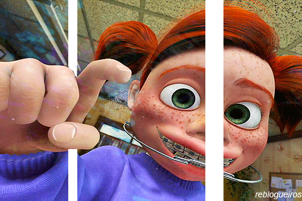

# Lesson Images

Para inserir imagens no markdown, você pode seguir os seguintes métodos.

## Image one

Para imagens a escrita segue muito similar ao de links, sendo que a única diferença é a adição de um ponto de exclamação antes dos colchetes

**Dica:** caso a imagem esteja dentro da pasta onde se está o arquivo markdown, basta digitar o nome da pasta e o nome do arquivo, caso contrário o caminho completo da imagem deve ser adicionado entre os parenteses.

## Image two

Para imagens, também podemos ter uma lista de variáveis seguindo a mesma estrutura dos links, onde suas imagens podem ser facilmente chamadas em diversos locais do documento, facilitando a manutenção caso seja necessário trocar uma imagem em diversos locais.

[image-black]: images/imagem01.png

Depois basta inserir o nome da variável no segundo colchetes conforme a mesma estrutura apresentada na escrita de links, adicionando o ponto de exclamação no início da linha.

![Super Black Friday][image-black]

## Image link one

Para adição de imagens com links, você escrever sua imagem como apresentado acima, utilizando o ponto de exclamação no início, o nome da imagem dentro de colchetes, seguindo com o caminho da imagem dentro dos parentes, logo depois irá colocar todo o caminho escrito e adicionar dentro de novos colchetes seguindo com o caminho do link dentro de parentes

## Image link two

[image-thanks]: images/thanks.gif
[link-repository]: https://github.com/junior-maciel/markdown "Obrigado!"

Podemos utilizar o métodos de variáveis para padronizar links e imagens, e escrever nosso link todo com variáveis, facilitando assim a manutenção de seu conteúdo escrito em diversos locais no seu documento.

[![Thank you][image-thanks]][link-repository]